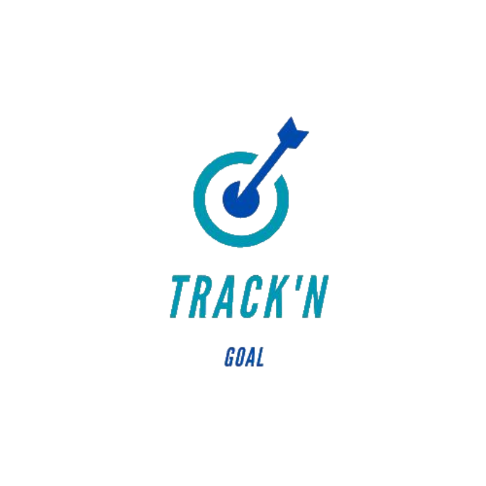

[![Contributors][contributors-shield]][contributors-url]
[![Forks][forks-shield]][forks-url]
[![Stargazers][stars-shield]][stars-url]
[![Issues][issues-shield]][issues-url]
[![MIT License][license-shield]][license-url]

<br />
<div align="center">
  <a href="https://github.com/Rima119/Track-n-Goal/">
    
  </a>

  <h3 align="center">Track'N Goal</h3></h3>

  <p align="center">
    A goal tracking Web/Mobile (Andoid & iOS) application.
    <br />
    <br />
    <br />
    <a href="https://rima119.github.io/Track-n-Goal/">Landing Page</a>
    ·
    <a href="https://github.com/Rima119/Track-n-Goal/issues">Report Issues</a>
    ·
    <a href="https://github.com/Rima119/Track-n-Goal/issues">Request Feature</a>
  </p>
</div>


## Contents
- [Introduction](#introduction)
- [Installation](#installation)
- [Usage](#usage)
- [Features](#features)
- [Contributing](#contributing)
- [Related projects](#relatedprojects)
- [Licensing](#licens)


## Introduction
Track'N Goal is a flutter-based Goal tracking Web/Mobile (Andoid & iOS) application that help users to achieve their goals by tracking their progress and reminding them to work on their goals.

### Built With

[![Flutter][flutter]][flutter-url]
[![Dart][dart]][dart-url]
[![Firebase][firebase]][firebase-url]

### Features
- Support for both offline and online mode.
- Sign-in with Email/Password or Google Account or Mobile phone to sync and preserve data.
- Set Remiders for Goals
- Set reminder notifications.

## Installation

1. Install Flutter by following the instructions at https://flutter.dev/docs/get-started/install.

2. Clone this repository to your local machine.
        ```sh
        git clone https://github.com/Rima119/Track-n-Goal.git
        ```

3. Navigate to the repository directory in a terminal.
        ```sh
        cd Track-n-Goal
        ```

4. Install the dependencies.
        ```sh
        flutter pub
        ```

5. Build and run the app on your device or emulator.
        ```sh
        flutter run
        ```

## Usage

## Contributing

## Related projects

## Licensing
This project is licensed under the [MIT License](https://github.com/Rima119/Track-n-Goal/blob/main/LICENSE.txt) - see the LICENSE.txt file for details.


[contributors-shield]: https://img.shields.io/github/contributors/Rima119/Track-n-Goal.svg?style=for-the-badge
[contributors-url]: https://github.com/Rima119/Track-n-Goal/graphs/contributors
[forks-shield]: https://img.shields.io/github/forks/Rima119/Track-n-Goal.svg?style=for-the-badge
[forks-url]: https://github.com/Rima119/Track-n-Goal/forks
[stars-shield]: https://img.shields.io/github/stars/Rima119/Track-n-Goal.svg?style=for-the-badge
[stars-url]: https://github.com/Rima119/Track-n-Goal/stargazers
[issues-shield]: https://img.shields.io/github/issues/Rima119/Track-n-Goal.svg?style=for-the-badge
[issues-url]: https://github.com/Rima119/Track-n-Goal/issues
[license-shield]: https://img.shields.io/github/license/Rima119/Track-n-Goal.svg?style=for-the-badge
[license-url]: https://github.com/Rima119/Track-n-Goal/blob/main/LICENSE.txt

[flutter]: https://www.vectorlogo.zone/logos/flutterio/flutterio-icon.svg
[flutter-url]: https://flutter.dev
[dart]: https://www.vectorlogo.zone/logos/dartlang/dartlang-icon.svg
[dart-url]: https://dart.dev
[firebase]: https://www.vectorlogo.zone/logos/firebase/firebase-icon.svg
[firevase-url]: hhttps://firebase.google.com/